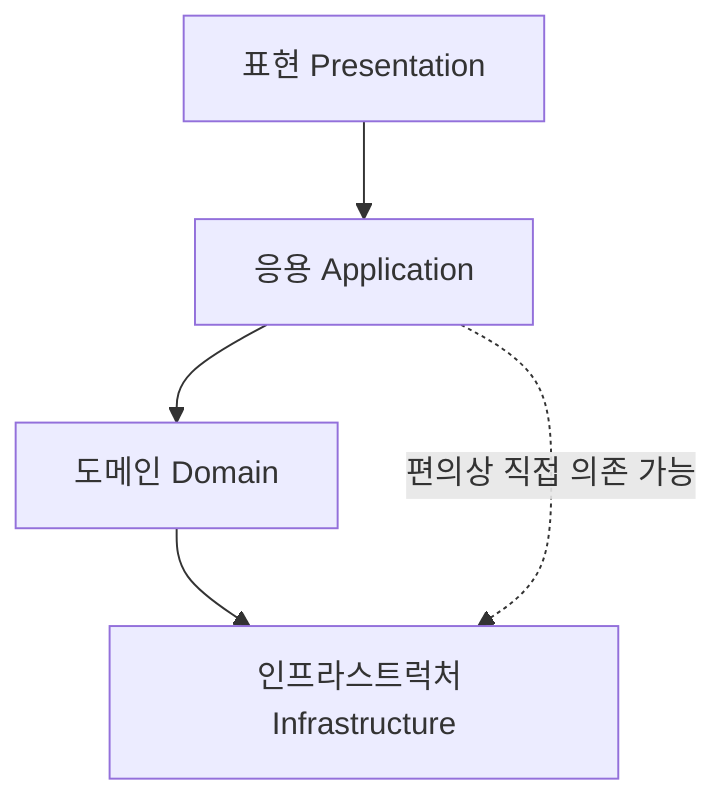
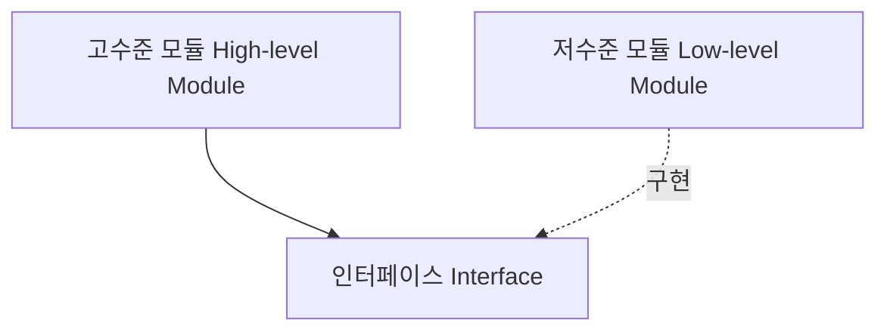
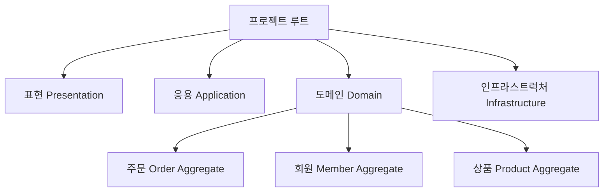

## 1. 아키텍처 (Architecture)

아키텍처는 4개의 영역으로 구성되어 있다.

### 1-1. 표현 영역 (Presentation Layer)

<br/>

UI 영역에 해당하며, 사용자의 요청을 받아 응용 영역에 전달하고 응용 영역의 처리 결과를 다시 사용자에게 전달하는 역할을 한다. 웹 브라우저나 REST API가 이에 해당한다. MVC 패턴에서는 `Controller`에 해당한다.

### 1-2. 응용 영역 (Application Layer)

<br/>

사용자에게 제공할 기능을 구현하는 영역이다. 예를 들어 주문 등록, 주문 취소, 상품 상세 조회 등이 있다. 도메인 영역의 도메인 모델을 사용하여 기능을 구현하며, MVC 패턴에서는 `Service`에 해당한다. 로직을 직접 수행하기보다는 도메인 모델에 로직 수행을 위임한다.

### 1-3. 도메인 영역 (Domain Layer)

<br/>

도메인 모델을 구현하고, 핵심 로직을 수행하는 영역이다.

### 1-4. 인프라스트럭처 영역 (Infrastructure Layer)

<br/>

구현 기술에 해당하는 영역으로, DB 연동 처리, 메시징 큐 처리, REST API 호출, SMTP 구현 등이 포함된다. 표현, 응용, 도메인 영역은 구현 기술을 사용할 코드를 직접 다루지 않아야 한다.

<br/><br/>

<br/><br/>

---

<br/><br/>

<br/><br/>

## 2. 계층 구조 (Layer Structure)

표현 → 응용 → 도메인 → 인프라스트럭처 순서로 계층이 구성된다. 상위 계층에서 하위 계층으로의 의존만 존재하며, 하위 계층은 상위 계층에 의존하지 않는다.

다만 구현의 편리함을 위해 응용이 직접 인프라스트럭처 계층에 의존하는 등의 유연성은 허용된다.



<br/><br/>

<br/><br/>

---

<br/><br/>

<br/><br/>

## 3. DIP (Dependency Inversion Principle)

**의존 역전 원칙 (Dependency Inversion Principle, DIP)**은 고수준 모듈이 저수준 모듈에 의존하는 문제를 해결하기 위한 원칙이다.

<small>*계층의 의존과 모듈의 의존은 분리해서 생각해야 한다.*</small>

### 3-1. 고수준 모듈과 저수준 모듈 (High-level & Low-level Modules)

<br/>

- **고수준 모듈 (High-level Module)**: 의미 있는 단일 기능을 제공하는 모듈
  - (예) 가격 할인 계산 기능
  - 보통 계층 구조에서 표현, 응용, 도메인에 해당
- **저수준 모듈 (Low-level Module)**: 하위 기능을 실제로 구현하는 모듈
  - (예) 가격 할인 계산 시 필요한 고객 정보를 DB에서 가져오거나, Drools라는 기술을 이용하는 것
  - 보통 계층 구조에서 인프라스트럭처에 해당한다.

### 3-2. 상위 계층이 하위 계층에 의존할 때의 문제점

<br/>

계층 구조에서 상위 계층이 하위 계층에 의존하게 되면 두 가지 문제가 존재한다.

1. 특정 기술에 너무 의존적이 되어 다른 기술로 변경하기 어려워진다.
2. 테스트하기 어려워진다.

### 3-3. DIP의 해결 방식

<br/>

DIP는 고수준 모듈이 저수준 모듈을 의존하는 것이 아니라, **저수준 모듈이 고수준 모듈을 의존하도록** 뒤집는다. 이를 위해 추상화한 인터페이스를 사용한다.

고수준 모듈이 저수준 모듈에서 사용하고 싶은 기능을 인터페이스로 제공하고, 저수준 모듈은 이 인터페이스를 상속해서 실제 구현을 수행한다.



### 3-4. 테스트 용이성

<br/>

인터페이스를 상속하는 `mock` 객체를 생성하면 실제 DB 등에 연결되지 않더라도 테스트가 가능해진다.

다른 기술을 사용하고 싶으면 인터페이스를 상속하는 다른 인프라스트럭처 객체를 만들면 된다.

### 3-5. DIP 주의사항

<br/>

- 저수준 모듈에서 인터페이스를 추출하지 않도록 주의해야 한다. 추상화된 인터페이스는 **고수준 모듈 관점**에서 도출해야 한다.
  - (예) DB의 CRUD를 추상화한 인터페이스 → 저수준 관점
  - (예) 기능을 이용해 할인율을 도출하는 인터페이스 → 고수준 관점
- 사용하는 기술에 따라 완벽한 DIP를 적용하기보다는, 구현 기술에 의존적인 코드를 도메인에 일부 포함하는 것이 효과적일 때도 있다. 무조건 DIP를 시도하지 말고 DIP의 이점을 얻는 수준에서 이용하자.
- 무조건 인프라스트럭처에 대한 의존을 없앨 필요는 없다. 예를 들어 스프링이 제공하는 `@Transactional` 같은 기능은 구현의 편리함이 DIP의 장점만큼 중요하기 때문이다.


<br/><br/>

<br/><br/>

---

<br/><br/>

<br/><br/>

## 4. 도메인 영역 구성요소 (Domain Layer Components)

| 구성요소 | 설명 | 예시 |
|---------|------|------|
| 엔터티 (Entity) | 고유 식별자를 가진 객체. 자신만의 라이프 사이클을 가지며, 데이터와 기능을 함께 제공 | 주문, 회원, 상품 |
| 밸류 (Value) | 고유 식별자가 없는 객체. 개념적으로 하나의 값을 표현 | 주소, 금액 |
| 애그리거트 (Aggregate) | 엔터티와 밸류를 연관된 것끼리 하나로 묶은 것 | 주문 → 주문, 배송지 정보, 주문자, 주문 목록 |
| 리포지토리 (Repository) | 엔터티를 조회하거나 저장하는 기능을 추상화하여 제공 | — |
| 도메인 서비스 (Domain Service) | 특정 엔터티에 속하지 않는 도메인 로직 제공 | 여러 엔터티와 밸류를 필요로 하는 공통 로직 |

### 4-1. 엔터티 (Entity)

<br/>

고유 식별자가 있는 객체로, 자신만의 라이프 사이클을 가진다.

도메인의 고유한 개념을 표현하며 데이터와 **기능**을 함께 제공한다는 점에서 DB 관계형 모델의 엔터티와 차이가 있다. 기능을 캡슐화해서 데이터가 임의로 변경되는 것을 막는다.

### 4-2. 밸류 (Value)

<br/>

고유 식별자가 없는 객체로, 개념적으로 하나의 값을 표현한다.

주소나 금액 같은 것이 이에 해당한다. 엔터티의 속성으로 사용할 뿐만 아니라 다른 밸류 타입의 속성으로도 사용할 수 있다.

### 4-3. 애그리거트 (Aggregate)

<br/>

엔터티와 밸류를 연관된 것끼리 개념적으로 하나로 묶은 것이다.

일종의 카테고리 개념이다. 예를 들어 "주문" 애그리거트에는 주문, 배송지 정보, 주문자, 주문 목록 등이 포함된다.

애그리거트 군집에 속한 객체를 관리하는 **루트 엔터티 (Root Entity)**가 존재한다. 루트 엔터티에서 애그리거트에 속해 있는 엔터티와 밸류 객체를 이용해 애그리거트가 구현해야 할 기능을 제공한다.

```
애그리거트 단위로 구현을 캡슐화한다는 것이 객체 지향 구조의 상위 개념 같은 느낌이다.
```

### 4-4. 리포지토리 (Repository)

<br/>

엔터티를 조회하거나 저장하는 기능을 제공한다.

이 리포지토리는 고수준 모듈이다! 조회, 저장에 필요한 기능을 추상화해서 제공한다.

```
리포지토리가 고수준 모듈이라는 점이 헷갈린다. 어떻게 다른지 코드로 확인해보면 좋을 것 같다.
HBase 같은 경우 테이블을 구분해서 저장할 필요가 없는데,
그러면 도메인이나 리포지토리 단위가 MySQL을 기반으로 할 때보다 커질 수 있지 않을까?
```

### 4-5. 도메인 서비스 (Domain Service)

<br/>

특정 엔터티에 속하지 않는 도메인 로직을 제공한다. 공통 로직 같은 느낌으로, 여러 엔터티와 밸류를 필요로 하는 로직이 이에 해당한다.

<br/><br/>

<br/><br/>

---

<br/><br/>

<br/><br/>

## 5. 모듈 구조 (Module Structure)

아키텍처의 각 영역은 별도 패키지에 위치한다. 도메인 모듈은 도메인에 속한 애그리거트를 기준으로 다시 패키지를 구성한다.

한 패키지에 너무 많은 타입이 몰려서 불편하지 않도록 대략 10~15개 미만의 타입 개수로 유지하는 것이 좋다.


