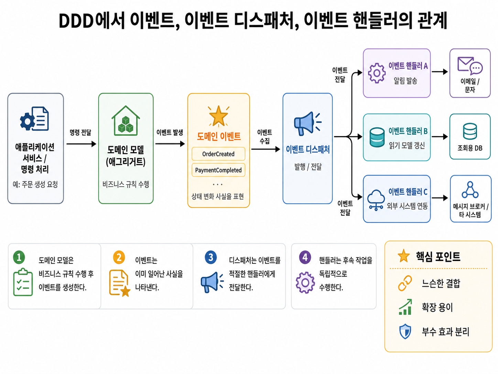

## 1. 이벤트란?

"과거에 벌어진 사건을 의미"

e.g. 암호를 변경했음. ➡ PasswordChangedEvent

### 1-1. 이벤트를 사용하는 목적

1. 컨텍스트 간 강결합(high coupling) 제거

```java
public class Order {
  // 주문 취소 발생 시 유저에게 환불하고 주문이 취소되었다고 통지를 하기 위해,
  // 주문 도메인인데 환불 및 통지 도메인 로직이 섞이는 현상이 발생
  // => 주문, 환불, 통지 컨텍스트 간 강결합
  public void cancel(RefundService refundSvc, NotiService notiSvc) {
    this.state = OrderState.CANCELED;
    ...
    refundSvc.refund();
    notiSvc.noti();
  }
}
```

2. 도메인 상태가 바뀌었을 때 후처리가 필요한 경우 사용

   e.g. 주문 취소 → 환불 처리: 주문이 취소되면, 환불 처리를 trigger 시킴

```java
public class Order {
  public void cancel() {
    this.state = OrderState.CANCELED;
    ...
    // 강결합을 끊으면서도, 원하는 후처리로 연결되도록 한다.
    Events.raise(new OrderCanceledEvent(number.getNumber()));
  }
}
```

3. 서로 다른 시스템 간 데이터 동기화로 사용 가능

   e.g. 유저가 배송지 변경 (이벤트 발생) →  외부 시스템에 배송지 전달 (후처리)


## 2. 이벤트 구성 요소



1) 이벤트 (class)
   - 변수명이 ~Event로 끝나고, 과거 시제를 쓰는 것이 일반적
   - 이벤트는 엔터티, 밸류, 도메인 서비스와 같은 도메인 객체에서 발생시킴
2) 이벤트 디스패처 (publisher)
   - 도메인에서 발생한 이벤트를 처리할 수 있는 핸들러에 이벤트를 전파하는 역할
   - 디스패처의 구현 방식에 따라 이벤트의 생성과 처리를 동기나 비동기로 실행

3. 이벤트 핸들러 (handler)
   - 이벤트에 반응해 적절한 기능을 수행하는 역할


## 3. 비동기 이벤트 처리 방법

### 3-1. 로컬 핸들러 비동기 실행 방법

- 스프링의 경우 `@EnableAsync`와 `@Async` 를 이용해 구현
- 가장 손쉽게 비동기 로직 구현 가능. 
- "같은 애플리케이션 안"에서 비동기를 처리하고 싶을 때 사용
- 복잡한 처리가 필요 없는 단순한 후처리나 모놀리스 시스템에 권장
- 단일 애플리케이션이기 때문에 이벤트 전달 도중에 애플리케이션이 죽으면, 이벤트가 유실되기도 쉽고 복구하기 어려울 수도 있음.

```java
@EnableAsync
@Configuration
public class AsyncConfig {
}
```

```java
@Component
public class OrderEventHandler {

    @Async
    @EventListener
    public void handle(OrderCreatedEvent event) {
        // 이메일 발송
        // 알림 발송
        // 로그 저장
    }
}
```


### 3-2. 메시지 큐 방법

* Kafka, RabbigMQ 등의 메시징 시스템 이용해 구현
* 개인적으로는 이벤트 저장소와 포워더 등을 직접 구현하기 보다는 이미 있는 기술인 카프카와 RabbitMQ 등을 사용하는 것이 나아 보인다.
* 서비스 간 비동기 연동 시 서비스 간 결합도를 낮출 수 있음. 서로의 서비스를 완전히 몰라도 되기 때문에.
* Producer와 Consumer가 분리되어 있기 때문에 확장성에 유리
* 단점은 Kafka를 운영하려면 카프카 특유의 개념들을 알아야하고, 카프카 서버를 별도로 운영이 필요

### 3-3. 이벤트 저장소와 이벤트 포워더 사용 방법

- 이벤트를 DB에 저장한 후, 별도 프로세스가 저장된 이벤트를 가져가서 핸들러를 실행하는 방식
- 장점은 DB 저장과 이벤트 저장을 같은 트랜잭션으로 묶을 수 있다는 점
  - DB의 상태는 변경되었는데 이벤트는 날라가는 문제를 줄일 수 있음
- 단점은 직접 만들어야 하기 때문에 이벤트 저장하는 DB부터 설계가 필요

```
OrderService
   ↓
Order 저장
OrderCreatedEvent를 outbox_event 테이블에 저장
   ↓
트랜잭션 커밋
   ↓
EventForwarder가 outbox_event 조회
   ↓
Kafka / RabbitMQ로 발행
   ↓
Consumer 처리
```


### 3-4. 이벤트 저장소와 이벤트 제공 API 사용 방법

* 이벤트를 DB에 저장한 후, API를 이용해 저장된 이벤트를 가져와서 핸들러를 실행하는 방식
* 외부 시스템이 pull 방식으로 가져가야 할 때
* 우리가 이벤트를 발행만 하고 어떻게 가져다 쓰는지 상관하지 않을 때 좋은 방법인 것으로 보인다.

